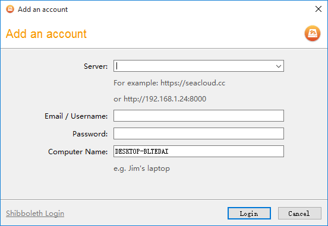
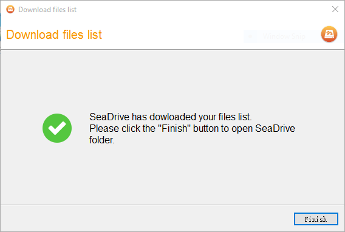
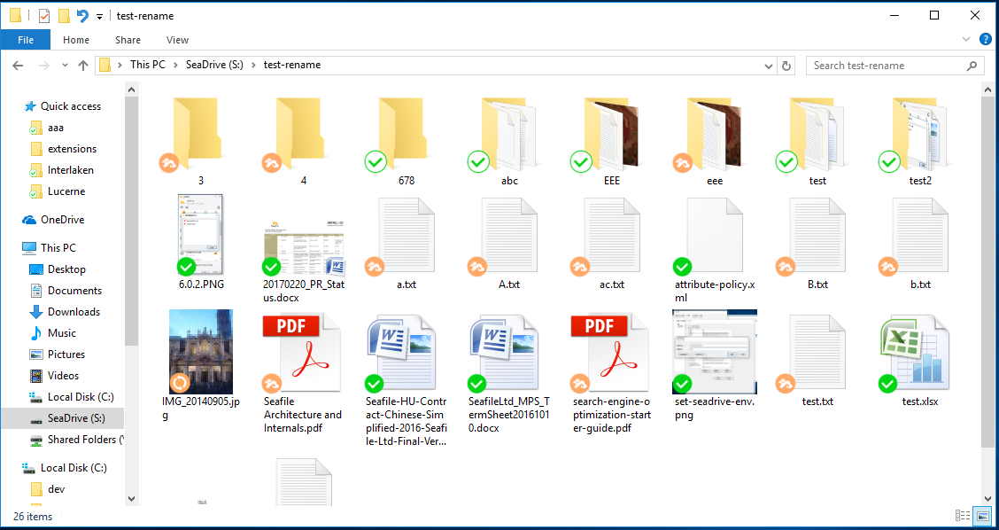

# Using Seafile Drive Client

After installing Drive client with the instructions on the [download page](https://www.seafile.com/en/download/), you can double click the "SeaDrive" app icon on your desktop to start the Drive client.

You'll be asked to choose a drive letter for the virtual drive. By default, "S:" will be used.

Then you'll be asked to log into your Seafile server.

After successfully log into the server, the Drive client starts to fetch library and file list from the server. The file contents are not downloaded at this moment. So it'll not take very long. You can let it run in the background. You'll be noticed when the fetch is done.

The virtual drive folder will be opened. You'll find it works just like an ordinary hard drive on your computer. The top level folders in the virtual drive are libraries on the Seafile server. File contents will be downloaded when you open a file. Recently opened file will be cached in your local disk. All cached files will be marked with a green tick.

Files and folders in the virtual drive are in either cloud-only, synced, or in partially synced state.

#### Cloud-only content

Cloud-only content shows in the virtual drive, but doesn’t use the full amount of space that the file would. In your file explorer, you can see the file, but the content isn’t fully downloaded until you need it. Only information about the file, such as the file name, size and date the file was updated, is downloaded.

#### Synced content

Synced content is downloaded and saved on the hard drive of your computer. You can directly edit these files from applications on your computer.

#### Partially synced content

Partially synced folders contain both synced and cloud-only files or folders.

For files that are already synced to local computer, they may be in 3 other special states, besides the normal "synced" state.

#### Locked by other user

The file is locked by other user on the server. You can only open the file in read-only mode. You cannot modify, delete or rename the file.

#### Locked by me

The file is locked by you. This prevents others from modifying the file.

#### Read-only

The folder or library of this file is shared with read-only permission to you. You cannot modify, delete or rename the file.

The Drive client regularly cleans up unused cached files in the background. You can also limit the local cache space.

You can log into multiple accounts in the Drive client. However, only files on the current selected server will be shown in the virtual drive. You can switch among accounts.

### FQA

**1\. Why can't I create new files or delete folders in root folder?**

The root folder of the virtual drive contains only library folders. Seafile can only sync files inside libraries. Files in the root folder cannot be uploaded to Seafile server. So it doesn't make sense to support creating files in root folder. Since the top level folders in the virtual drive represents libraries, we don't want users to delete their libraries by mistake. So the Drive client doesn't support deleting top level folders.